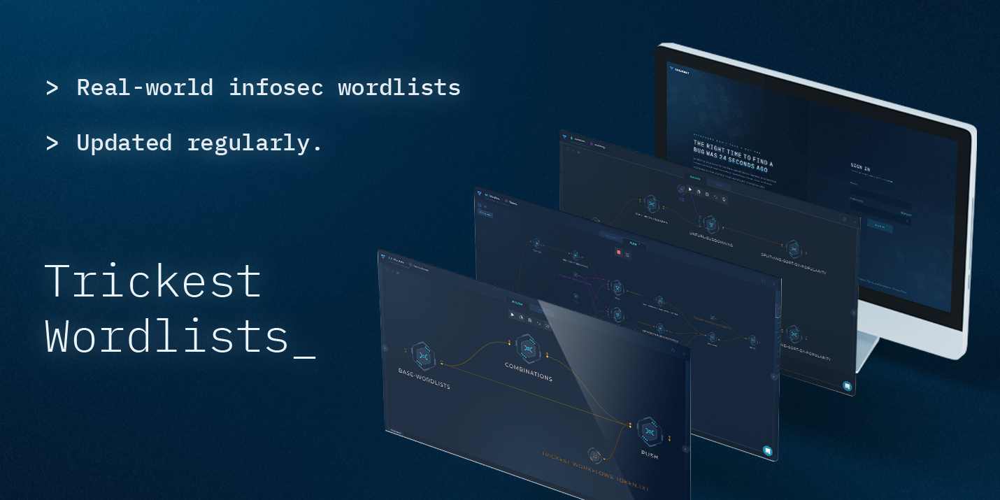
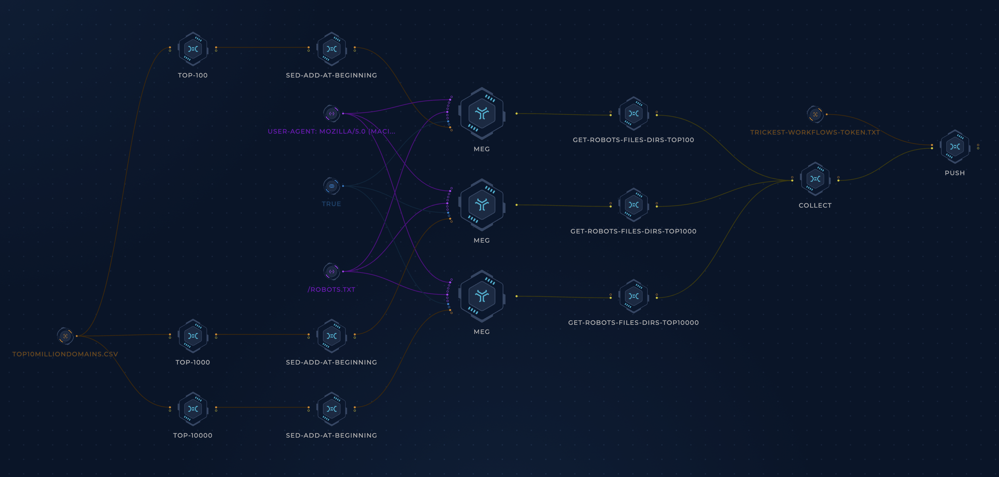

<h1 align="center">Wordlists <a href="https://twitter.com/intent/tweet?text=Wordlists%20-%20Real-world%20infosec%20wordlists%2C%20updated%20regularly%20by%20%40trick3st%0A%0Ahttps%3A%2F%2Fgithub.com%2Ftrickest%2Fwordlists&hashtags=bugbounty,bugbountytips,infosec"></a></h1>
<h3 align="center">Real-world infosec wordlists, updated regularly</h3>


## Current Wordlists
### Technologies
These wordlists are based on the source code of the CMSes/servers/frameworks listed [here](technology-repositories.json). The current wordlists include:
- Wordpress
- Joomla
- Drupal
- Magento
- Ghost
- Tomcat

There are 2 versions of each wordlist:
- Base (example [tomcat.txt](technologies/tomcat.txt)): Lists the full paths of each file in the repository
```
webapps/examples/WEB-INF/classes/websocket/echo/servers.json
```
- All levels (example [tomcat-all-levels.txt](technologies/tomcat-all-levels.txt)): Includes all directory levels of the files in the base wordlist - if you have tried [dsieve](https://github.com/trickest/dsieve), this is going to look familiar! This wordlist will be larger than the base wordlist but it accounts for cases where the directory structure of the repository isn't mapped perfectly on the target.
```
webapps/examples/WEB-INF/classes/websocket/echo/servers.json
examples/WEB-INF/classes/websocket/echo/servers.json
WEB-INF/classes/websocket/echo/servers.json
websocket/echo/servers.json
echo/servers.json
servers.json
```

### Robots
Inspired by Daniel Miessler's [RobotsDisallowed](https://github.com/danielmiessler/RobotsDisallowed) project, these wordlists contain the `robots.txt` `Allow` and `Disallow` paths in the top 100, top 1000, and top 10000 websites according to [Domcop's Open PageRank dataset](https://www.domcop.com/top-10-million-websites).

And more wordlists to come!

## How it Works
### Technologies
A [Trickest](https://trickest.com) workflow clones the repositories in [technology-repositories.json](technology-repositories.json), lists the paths of all their files, removes non-interesting files, generates combinations, and pushes the wordlists to this repository.


### Robots
Another [Trickest](https://trickest.com) workflow gets the top 100, 1000, and 1000 websites from [Domcop's Open PageRank dataset](https://www.domcop.com/top-10-million-websites), uses [meg](https://github.com/tomnomnom/meg) to fetch their `robots.txt` files (Thanks, [@tomnomnom](https://github.com/tomnomnom)!), removes irrelevant entries, cleans up the paths, and pushes the wordlists to this repository.


## Contribution
All contributions/suggestions/questions are welcome! Feel free to create a new ticket via [GitHub issues](https://github.com/trickest/wordlists/issues), tweet at us [@trick3st](https://twitter.com/trick3st), or join the conversation on [Discord](https://discord.gg/7HZmFYTGcQ).

## Build your own workflows!
We believe in the value of tinkering. Sign up for a demo on [trickest.com](https://trickest.com) to customize this workflow to your use case, get access to many more workflows, or build your own from scratch!

[](https://trickest-access.paperform.co/)
